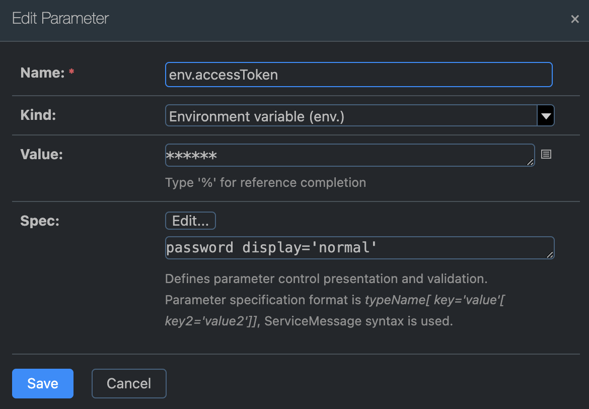
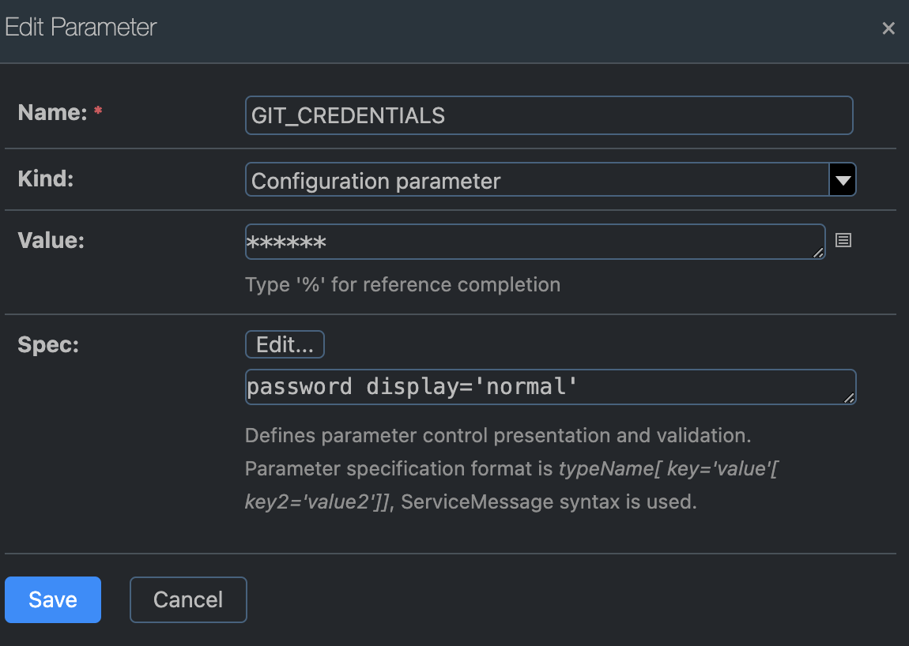
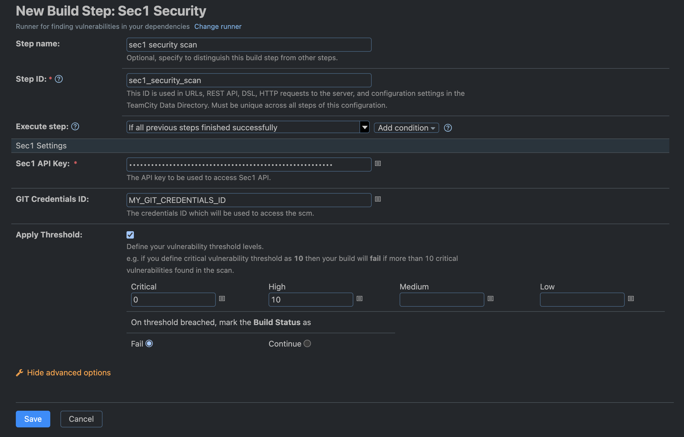

# Teamcity Plugin

Teamcity Version 2023.11.1 (build 147412)

## Introduction

Integrating the Sec1 Security plugin with TeamCity allows developers and teams to enhance the security of their software projects by scanning Source Code Management (SCM) repositories for open-source vulnerabilities against the Sec1 Security Database. This documentation provides a step-by-step guide on integrating the Sec1 Security plugin into your TeamCity CI/CD pipelines.

## Integration Steps

1. [Install the Sec1 Security Plugin](#1-install-the-sec1-security-plugin)
2. [Configure an SCM Access Token](#2-configure-an-scm-access-token)
3. [Configure Sec1 Security as a Build Step](#3-configure-sec1-security-as-a-build-step)
4. [Configuration Parameters](#4-configuration-parameters)
   
## 1. Install the Sec1 Security Plugin

- Go to "Administration" > "Plugins" in your TeamCity instance.
- Navigate to "Browse plugins repository".
- Search for "Sec1 Security" and click on the search result to visit the plugin page.
- From the "Get" dropdown, select the "Install" option, or download the ZIP.

 If downloading the ZIP:

- Go to "Administration" > "Plugins". 
- Click on "Upload plugin zip".
- Select the plugin zip from downloaded location.
- Click on "Upload plugin zip" of the popup window.

<b>Note</b>: Ensure that you have enabled the Sec1 Security plugin.

## 2. Configure an SCM Access Token

  As an Environment Variable
  
- Go to your "Project" > "Parameters"
- Click "Add new parameter"
- Select "Kind" as "Environment variable"
- Set the environment variable name as "accessToken", which the Sec1 plugin uses to access your VCS root URL for scanning.
- Click "Edit" beside "Sepc".
- Select "Type" as "Password".

<b>Note</b>: If you want to scan public url then don't pass accessToken and credentialsId.

<blockquote>

📷 Show Preview

</blockquote>

  As Configuraton Parameter
  
- Go to your "Project" > "Parameters".
- Click "Add new parameter".
- Select "Kind" as "Configuration parameter".
- Give the configuration parameter a name (remember this name for use in the "Sec1 Build Step").
- Click "Edit" beside "Sepc".
- Select "Type" as "Password".

<blockquote>

📷 Show Preview

</blockquote>

## 3. Configure Sec1 Security as a Build Step

- Navigate to "Build Steps" screen in your project.
- Click on "Add build step".
- Search "Sec1 Security" in the search box and select the result.
- Add "Sec1 API Key".

  <b>Note</b> : To get `SEC1_API_KEY` navigate to [Scopy](https://scopy.sec1.io/) > "Login with GitHub" > "Settings"
  In the "API key" section, click on "Generate API key" and copy it for use.

<blockquote>

📷 Show Preview

</blockquote>

## 4. Configuration Parameters

### Configure the following parameters in the "Sec1 Settings" section:

  * `Sec1 API Key`: (<b>required</b>) The API key to be used to access Sec1 API.

  * `GIT Credentials ID`: (<b>optional</b>) The ID which will be used to access the SCM. This is the configuration parameter ID set in "Parameters" > "Add new parameter."

  * `Apply Threshold` (<b>optional</b>) If selected, define your vulnerability threshold levels by "Severity". Default values for Critical and High are 0 and 10 respectively   
    
    * If you set the critical vulnerability threshold to 10, your build will fail if more than 10 critical vulnerabilities are found in the scan.
    * Choose actions for the breach: Fail or Continue.

## Troubleshooting

To see more information on your steps:

- View the "Console Output" for a specific build.

---

-- Sec1 team